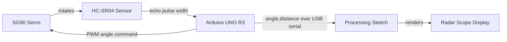

# Ultrasonic Radar

## Introduction

A working plan-position-indicator (PPI) radar built from an Arduino UNO R3, an HC-SR04 ultrasonic sensor and an SG90 servo. The servo sweeps the sensor through a 150° arc, the Arduino measures the time-of-flight to the nearest object at each bearing, and a Processing sketch plots the results as a live radar scope with range rings, a rotating sweep line and fading contacts.


---

## What it does

- Sweeps 15°–165° in 1° steps, measuring on both the outward and return legs
- Measures range from 2 cm to 200 cm by ultrasonic time-of-flight
- Streams readings over USB serial as line-delimited `angle,distance` pairs
- Renders a radar scope at ~60 fps with contact persistence and acoustic-shadow indication
- Auto-detects the serial port, with a manual override

**Full sweep time:** 3–5 s · **Angular sampling:** 1° · **Range accuracy:** ±2 cm typical

---

## Hardware

| Component | Detail |
|---|---|
| Arduino UNO R3 | Elegoo clone, CH340 USB-serial |
| HC-SR04 | 40 kHz ultrasonic transceiver, ~15° beam width |
| SG90 | 9 g micro servo, PWM position control |
| 100 µF capacitor | Optional, decouples the servo current spike |

### Wiring

| Signal | Arduino pin |
|---|---|
| HC-SR04 `Trig` | D10 |
| HC-SR04 `Echo` | D11 |
| SG90 signal | D12 |
| HC-SR04 `VCC`, SG90 red | 5V |
| HC-SR04 `GND`, SG90 brown | GND |

---

## Quick start

```bash
git clone https://github.com/<your-username>/arduino-radar.git
cd arduino-radar
```

1. Wire the circuit as above.
2. Open `arduino/radar_sweep/radar_sweep.ino` in the Arduino IDE, select **Arduino Uno** and your port, and upload.
3. Confirm the stream in the Serial Monitor at **115200 baud**, then **close the Serial Monitor** — only one program can hold the port.
4. Open `processing/radar_display/radar_display.pde` in Processing and press **Run**.

Detailed assembly instructions, theory of operation and a troubleshooting table are in **[docs/BUILD_GUIDE.md](docs/BUILD_GUIDE.md)**.

---

## How it works

The HC-SR04 is fundamentally a stopwatch. A 10 µs trigger pulse makes it emit eight 40 kHz bursts and hold its `Echo` line high for exactly as long as the sound is in flight. Since the pulse travels out to the target and back, range is half the round trip:

```
distance_cm = (echo_time_us × 0.0343) / 2
```

where 0.0343 cm/µs is the speed of sound at 20 °C. There is no "nothing detected" signal — the sensor simply never raises `Echo` — so a 15 ms timeout on `pulseIn()` is what makes an empty bearing cheap to measure rather than a full-second stall.

The servo is commanded by pulse width (~1.0 ms = 0°, ~2.0 ms = 180°, repeated every 20 ms), generated by the `Servo` library in a Timer1 interrupt. `write()` returns immediately, well before the horn has physically arrived, so the firmware waits `SETTLE_MS` before pinging. Skipping that wait measures whatever the sensor was pointing at mid-swing and smears every edge in the display.

Each reading crosses to the host as one line of ASCII. The Processing client converts the polar reading to screen coordinates (`x = cx + r·cos θ`, `y = cy − r·sin θ`, with the minus sign because screen Y grows downward) and stores it with a timestamp, fading it out over `TRAIL_MS` to imitate the long-persistence phosphor of a real scope.

---

## Serial protocol

One measurement per line, newline-terminated:

```
<angle>,<distance_cm>\n
```

- `angle` — integer degrees, 0–180
- `distance_cm` — integer centimetres, or `0` for no contact
- Lines beginning with `#` are comments and are ignored by the client

The format is deliberately plain text: it is self-synchronising (a truncated line at connect time is simply discarded), stateless (a dropped line costs one pixel, not the session), and debuggable with nothing more than a serial terminal.

---

## Configuration

Both sketches are tuned from constants at the top of the file. `BAUD` and `MAX_RANGE_CM` **must match** on both sides.

**`radar_sweep.ino`**

| Constant | Default | Effect |
|---|---|---|
| `ANGLE_MIN` / `ANGLE_MAX` | 15 / 165 | Sweep limits; keeps the SG90 off its stops |
| `ANGLE_STEP` | 1 | Degrees per measurement; raise for a faster sweep |
| `SETTLE_MS` | 15 | Servo settling time before each ping |
| `ECHO_TIMEOUT_US` | 15000 | Caps the wait for an echo (~257 cm) |
| `SAMPLES` | 1 | Pings per bearing; set 3 for median filtering |
| `MAX_RANGE_CM` | 200 | Readings beyond this are reported as no-contact |

**`radar_display.pde`**

| Constant | Default | Effect |
|---|---|---|
| `FORCE_PORT` | `""` | Override auto-detection with e.g. `/dev/cu.usbserial-1410` |
| `MIRROR_X` | `false` | Flip left/right if the display is mirrored |
| `TRAIL_MS` | 1500 | Contact persistence time |

---

## Project structure

```
arduino-radar/
├── arduino/radar_sweep/radar_sweep.ino     # firmware: sweep, range, transmit
├── processing/radar_display/radar_display.pde  # host: parse and plot
├── docs/BUILD_GUIDE.md                     # assembly, theory, troubleshooting
├── docs/media/                             # screenshots
├── LICENSE
└── README.md
```

Both IDEs require a sketch to live in a folder of the same name, which is why the two source files are nested rather than sitting at the root.

---

## Limitations

- **Angular resolution is beam-limited, not step-limited.** The HC-SR04's ~15° beam smears narrow objects across many bearings; 1° stepping samples finer than the sensor can actually resolve.
- **Only the nearest reflector per bearing is visible.** Everything behind it is in acoustic shadow, shown explicitly as a red streak.
- **Soft and angled targets reflect poorly.** Cloth absorbs 40 kHz; surfaces tilted beyond ~30° deflect the pulse away from the receiver.
- **Slow refresh.** A servo-limited 3–5 s per sweep means fast-moving objects are smeared or missed.
- **No temperature compensation.** The speed of sound varies ~0.17% per °C; readings drift by a couple of percent across normal room temperatures.

## Possible extensions

- Temperature-compensated speed of sound using the kit's thermistor
- Contact clustering and inter-sweep tracking to estimate target velocity
- CSV logging and offline analysis
- Accumulated occupancy grid to build a crude floor plan
- Browser-based scope over WebSockets in place of Processing

---

## Licence

MIT — see [LICENSE](LICENSE).

# hvhjvkhjvhjvhj,vhjhvh h ,hjbhjvhjvhvjvb bvvhjvyvhj bgvtfyufyukjmjvcrumygjyhnmvcfxrdugkjhvgfhdtgujkhgt

# 📡 Arduino Ultrasonic Radar


A servo-mounted ultrasonic sensor sweeps a 150° arc while an Arduino UNO times the echo at every bearing; a companion Processing sketch turns that stream of numbers into a live plan-position-indicator (PPI) display — the sweeping, fading radarscope picture used on ships and in air-traffic control — built end-to-end from a beginner electronics kit.

**Sweep arc:** 15°–165° &nbsp;·&nbsp; **Range:** 2–200 cm &nbsp;·&nbsp; **Full sweep:** ~3–4 s &nbsp;·&nbsp; **Display:** ~60 fps

## Demo


<!-- Press "S" while the Processing sketch is running to save a screenshot into the sketch folder, then move it to docs/media/screenshot.png. A short screen recording (Cmd+Shift+5) converted to a GIF at docs/media/demo.gif is even more convincing than a still image — embed it the same way and it autoplays on the repo page. -->

## Contents

- [Features](#features)
- [Skills Demonstrated](#skills-demonstrated)
- [How It Works](#how-it-works)
- [Hardware and Wiring](#hardware-and-wiring)
- [Quick Start](#quick-start)
- [Serial Protocol](#serial-protocol)
- [Configuration](#configuration)
- [Project Structure](#project-structure)
- [Limitations](#limitations)
- [Roadmap](#roadmap)
- [License](#license)

## Features

- Sweeps 15°–165° in 1° steps, measuring on both the outward and return strokes for a faster effective refresh
- Ultrasonic time-of-flight ranging from 2–200 cm, with a 15 ms timeout so "nothing there" is detected quickly instead of stalling for a second
- A compact, self-synchronising serial protocol that's human-readable straight from the Arduino Serial Monitor
- A radar scope built from scratch in Processing: range rings, a rotating sweep line with a fading tail, and contacts that persist and decay like real radarscope phosphor
- Automatic serial port detection with manual override, and live on-screen connection status
- Every timing, range and display constant is named, commented and easy to retune

## Skills Demonstrated

- **Embedded C++** — non-blocking timing, working within a microcontroller's limited RAM (fixed-size buffers, `F()` macro to keep strings out of SRAM), interfacing with a hardware-timer-driven library
- **Sensor signal processing** — time-of-flight distance calculation, timeout-based failure detection, median filtering to reject single-ping outliers
- **Protocol design** — a minimal, stateless, line-delimited serial format that resynchronises itself after any dropped or truncated line
- **Real-time graphics programming** — polar-to-Cartesian coordinate transforms, alpha-based persistence rendering, a UI that degrades gracefully the moment data stops arriving
- **Hardware bring-up** — diagnosing USB-serial driver issues, servo current-spike brownouts, and mechanical binding on real (not simulated) hardware
- **Technical writing** — a build guide detailed enough for someone else to reproduce the project starting from an unopened kit

## How It Works



### Ultrasonic ranging

The HC-SR04 is fundamentally a stopwatch. A 10 µs pulse on `Trig` makes it emit eight 40 kHz bursts and hold `Echo` high for exactly as long as the sound is in flight. Since the pulse travels to the target and back, range is half the round trip:

```
distance_cm = (echo_time_us × 0.0343) / 2
```

where 0.0343 cm/µs is the speed of sound at 20 °C (it varies about 0.17% per °C, which is why precision setups add a thermometer). There's no explicit "nothing there" signal — `Echo` simply never goes high — so a 15 ms timeout on `pulseIn()` is what makes an empty bearing cost 15 ms instead of a full second.

### Servo sweep

An SG90 is positioned by pulse width, not by a data protocol: roughly 1.0 ms every 20 ms means 0°, 2.0 ms means 180°. The `Servo` library generates this in a Timer1 interrupt, so `servo.write(angle)` is all the firmware has to do — but critically, `write()` returns immediately, long before the horn has physically arrived. The firmware waits `SETTLE_MS` before pinging; skip that wait and you measure whatever the sensor was pointing at mid-swing, smearing every edge in the picture.

### The serial link

Each reading crosses to the host as one plain-text line: `angle,distance\n`. That simplicity is deliberate — it's self-synchronising (a truncated line at connect time is just discarded), stateless (one dropped line costs one pixel, not the session), and debuggable with nothing more than a serial terminal.

### From polar to picture

Every reading is a polar coordinate — a bearing and a range — and the screen is Cartesian:

```
x = cx + r·cos(θ)
y = cy − r·sin(θ)
```

The minus sign on `y` is because screen coordinates grow downward while 90° should point up. Contacts are stored with a timestamp and faded out over `TRAIL_MS`, imitating the long-persistence phosphor of a real radar scope.

## Hardware and Wiring

| Component | Detail |
|---|---|
| Arduino UNO R3 | Elegoo clone, CH340 USB-serial |
| HC-SR04 | 40 kHz ultrasonic transceiver, ~15° beam width |
| SG90 | 9 g micro servo, PWM position control |
| 100 µF capacitor | Optional — decouples the servo's current spike |

| Signal | Arduino pin |
|---|---|
| HC-SR04 `Trig` | D10 |
| HC-SR04 `Echo` | D11 |
| SG90 signal | D12 |
| HC-SR04 `VCC`, SG90 red | 5V |
| HC-SR04 `GND`, SG90 brown | GND |

The sensor is taped to a single-arm servo horn, transducers facing outward; the servo body is weighed down so it turns the sensor rather than itself. Full assembly photos, calibration notes and a troubleshooting table are in [`docs/BUILD_GUIDE.md`](docs/BUILD_GUIDE.md).

## Quick Start

```bash
git clone https://github.com/<your-username>/arduino-radar.git
cd arduino-radar
```

1. Wire the circuit as above.
2. Open `arduino/radar_sweep/radar_sweep.ino` in the Arduino IDE, select **Arduino Uno** and the correct port, and upload.
3. Check the stream in the Serial Monitor at **115200 baud** against a ruler, then **close the Serial Monitor** — only one program can hold the port at a time.
4. Open `processing/radar_display/radar_display.pde` in Processing and press **Run**.

## Serial Protocol

One measurement per line, newline-terminated:

```
<angle>,<distance_cm>\n
```

- `angle` — integer degrees, 0–180
- `distance_cm` — integer centimetres, or `0` for no contact
- Lines starting with `#` are comments, ignored by the display client

## Configuration

**`radar_sweep.ino`**

| Constant | Default | Effect |
|---|---|---|
| `ANGLE_MIN` / `ANGLE_MAX` | 15 / 165 | Sweep limits — keeps the SG90 off its mechanical stops |
| `ANGLE_STEP` | 1 | Degrees per measurement; raise for a faster sweep |
| `SETTLE_MS` | 15 | Servo settling time before each ping |
| `ECHO_TIMEOUT_US` | 15000 | Caps the wait for an echo (~257 cm) |
| `SAMPLES` | 1 | Pings per bearing; set to 3 for median filtering |
| `MAX_RANGE_CM` | 200 | Readings beyond this report as no-contact |

**`radar_display.pde`**

| Constant | Default | Effect |
|---|---|---|
| `FORCE_PORT` | `""` | Override auto-detection, e.g. `/dev/cu.usbserial-1410` |
| `MIRROR_X` | `false` | Flip left/right if the display comes out mirrored |
| `TRAIL_MS` | 1500 | Contact persistence time |

`BAUD` and `MAX_RANGE_CM` must match between the two sketches.

## Project Structure

```
arduino-radar/
├── arduino/radar_sweep/radar_sweep.ino          # firmware: sweep, range, transmit
├── processing/radar_display/radar_display.pde   # host: parse and plot
├── docs/BUILD_GUIDE.md                          # assembly, theory, troubleshooting
├── docs/media/                                  # screenshots and demo GIF
├── LICENSE
└── README.md
```

## Limitations

- **Angular resolution is beam-limited, not step-limited.** The HC-SR04's ~15° beam smears narrow objects across many bearings; 1° stepping samples finer than the sensor can actually resolve.
- **Only the nearest reflector per bearing is visible.** Everything behind it sits in acoustic shadow, shown on screen as a red streak.
- **Soft and angled targets reflect poorly.** Cloth absorbs 40 kHz; surfaces tilted beyond ~30° deflect the pulse away from the receiver.
- **Refresh is servo-limited.** A full sweep takes 3–4 s, so anything moving faster than a slow walk is smeared or missed.
- **No temperature compensation.** The speed of sound varies ~0.17% per °C, so readings drift a couple of percent across normal room temperatures.

## Roadmap

- [ ] Temperature-compensated speed of sound using the kit's thermistor
- [ ] Contact clustering and inter-sweep tracking to estimate target velocity
- [ ] CSV logging and offline analysis
- [ ] Accumulated occupancy grid to build a crude floor plan
- [ ] Browser-based scope over WebSockets in place of Processing

## License

MIT — see [LICENSE](LICENSE).

---

Built by **Your Name** — [LinkedIn](https://linkedin.com/in/yourprofile) · [Portfolio](https://yourwebsite.com)
